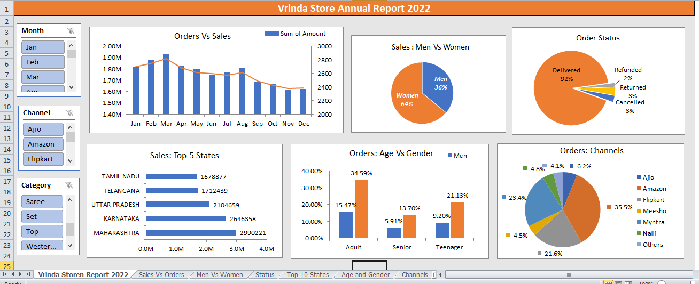

# 🛍️ Vrinda Store – Excel Data Analysis Dashboard

This project analyzes **Vrinda Store’s sales performance for 2022** using Excel.  
The interactive dashboard highlights key insights into sales, orders, customers, and channels — helping identify business opportunities and customer trends.  

---

## 📊 Dashboard Features
The Excel dashboard provides the following insights:
- **Orders vs Sales Trend** – Monthly revenue & order volume
- **Sales by Gender** – Women (64%) vs Men (36%)
- **Order Status** – Delivered, Returned, Cancelled, Refunded
- **Top 5 States by Sales** – Maharashtra, Karnataka, Uttar Pradesh, Telangana, Tamil Nadu
- **Orders by Age & Gender** – Teenagers, Adults, Seniors
- **Orders by Channels** – Ajio, Amazon, Flipkart, Meesho, Myntra, and others

---

## 📷 Dashboard Preview

---

## 📈 Key Business Insights
- Women customers contribute **64% of total sales** – higher than men.
- **Adults (35%) and Teenagers (21%)** are the largest customer groups.
- **Maharashtra** generates the highest sales among states.
- **Amazon (35.5%) and Flipkart (21.6%)** are the top-performing sales channels.
- **92% of orders were delivered successfully**, with only small percentages returned, cancelled, or refunded.

---

## 🛠️ Skills Practiced
- Excel Data Cleaning & Processing
- Pivot Tables & Pivot Charts
- Slicers for interactive filtering
- Dashboard Design & Formatting
- Data Visualization & Storytelling

---

## 📂 Files in this Repository
- `Vrinda Store Data Analysis.xlsx` → Interactive Excel dashboard  
- `Screenshot.png` → Dashboard preview image  
- `README.md` → Project documentation (this file)  

---

## 🎯 Project Type
✅ Guided Learning Project – Excel Dashboard Practice  
✅ Business-focused Data Analysis  

---

✍️ **Created by Haya Parveen**

